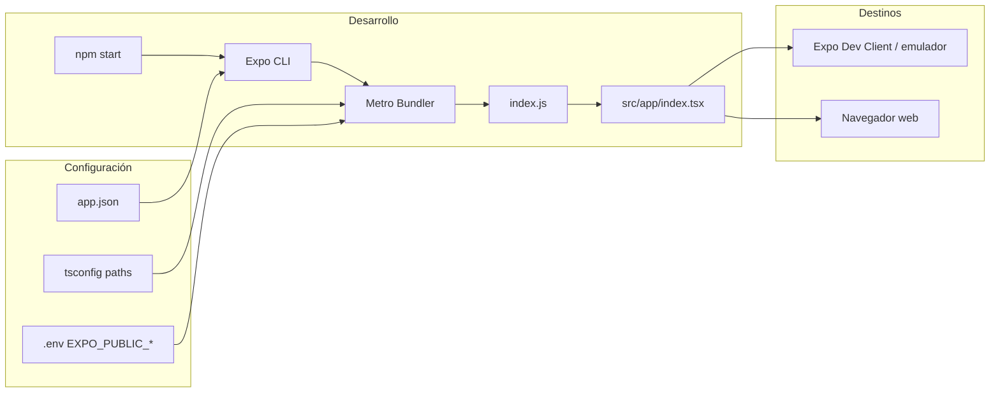

# Expo y Metro en eJoi — Guía para usar como plantilla

Este documento describe **cómo funciona Expo y Metro en este repositorio** y qué debes conservar o adaptar si quieres crear nuevas apps a partir de esta base.

---

## Resumen ejecutivo

| Aspecto | Decisión en este proyecto |
|--------|---------------------------|
| Framework | [Expo SDK 54](https://docs.expo.dev/) sobre React Native 0.81 |
| Bundler | **Metro** (por defecto de Expo; también explícito para web) |
| Punto de entrada | `index.js` → `src/app/index.tsx` |
| Navegación | **React Navigation** (stacks nativos), **no** Expo Router |
| Workflow nativo | **Managed + CNG**: carpetas `android/` e `ios/` se generan con prebuild y están en `.gitignore` |
| TypeScript | Alias `@/*` → `src/*` vía `tsconfig.json` |
| Builds en la nube | [EAS Build](https://docs.expo.dev/build/introduction/) (`eas.json`) |

> **Nota:** El `README.md` raíz y el script `reset-project` provienen del template `create-expo-app` y mencionan Expo Router. **La app real no usa Expo Router**; el código vive en `src/app/` con React Navigation. `expo-router` está en `package.json` como dependencia residual y puede eliminarse si no la necesitas.

---

## Cómo arranca la app (Metro → JavaScript → UI)

Metro es el bundler que empaqueta tu código TypeScript/JavaScript para cada plataforma. Expo lo configura y arranca por ti.

```
index.js
  └─ registerRootComponent(App)     ← API de Expo
       └─ src/app/index.tsx         ← Componente raíz
            ├─ Providers (i18n, tema, React Query, auth)
            └─ NavigationContainer + RootNavigator
```

### Punto de entrada (`index.js`)

```js
import { registerRootComponent } from "expo";
import App from "./src/app/index";

registerRootComponent(App);
```

- `main` en `package.json` apunta a `"index.js"`.
- `registerRootComponent` registra el componente raíz en el runtime nativo (equivalente a `AppRegistry.registerComponent`).

### Componente raíz (`src/app/index.tsx`)

Responsabilidades:

1. **Carga de fuentes** con `expo-font` (`useFonts` + `require()`).
2. **Providers globales** en este orden:
   - `I18nextProvider` (i18n)
   - `ThemeProvider`
   - `QueryProvider` (TanStack React Query)
   - `AuthProvider`
3. **Navegación** con `@react-navigation/native` (`NavigationContainer` + `RootNavigator`).
4. **Bootstrap de push** (`PushNotificationBootstrap`) dentro del contenedor de navegación.

---

## Metro: qué hace y qué no hay que tocar

### Configuración por defecto

Este proyecto **no tiene** `metro.config.js` ni `babel.config.js`. Expo SDK 54 incluye:

- **`@expo/metro-config`**: resolución de módulos, assets, soporte web, etc.
- **`babel-preset-expo`**: transpila TypeScript/JSX, activa plugins de Reanimated, etc.

Solo necesitas un `metro.config.js` personalizado si añades cosas como:

- Alias de módulos extra (más allá de los paths de `tsconfig.json`).
- Extensiones de archivo no estándar.
- Transformaciones custom de SVG u otros assets.

Ejemplo mínimo si algún día lo necesitas:

```js
const { getDefaultConfig } = require("expo/metro-config");

const config = getDefaultConfig(__dirname);

module.exports = config;
```

### Web con Metro

En `app.json`:

```json
"web": {
  "favicon": "./public/logos/eJoi_logos-01.png",
  "bundler": "metro",
  "output": "static"
}
```

- **`bundler: "metro"`**: la web usa el mismo bundler que iOS/Android (no Webpack).
- **`output: "static"`**: export estático para hosting (`npx expo export --platform web`).

Arrancar web en desarrollo:

```bash
npm run web
# equivalente a: expo start --web
```

### Alias de imports (`@/`)

`tsconfig.json`:

```json
"paths": {
  "@/*": ["./src/*"]
}
```

Expo/Metro leen estos paths automáticamente. Ejemplo:

```ts
import { API_URL } from '@/app/config/env';
import { RootNavigator } from '@/app/navigation/RootNavigator';
```

### Assets estáticos y `require()`

Metro solo incluye en el bundle lo que importas explícitamente:

```tsx
// Fuentes (src/assets/fonts/ o rutas relativas)
require('../../assets/fonts/ApisRegular.ttf')

// Imágenes (public/IMG/...)
require('../../../../public/IMG/eJoi_INTERFAZ-16.png')
```

Reglas prácticas:

| Carpeta | Uso |
|---------|-----|
| `src/assets/` | Fuentes, iconos e imágenes referenciadas con `require()` desde código |
| `public/` | Recursos estáticos (logos, tipografías en `app.json`, imágenes de UI) |
| `app.json → assetBundlePatterns` | `"**/*"` empaqueta assets amplios en builds nativos |

Las fuentes aparecen en **dos sitios** en este proyecto:

1. Declaradas en `app.json → expo.fonts` (para embebido nativo).
2. Cargadas en runtime con `useFonts()` en `src/app/index.tsx`.

Para una plantilla nueva, unifica en un solo enfoque si puedes (solo `useFonts` o solo `app.json`).

---

## Configuración de Expo (`app.json`)

Archivo central del proyecto Expo. Lo que define:

| Sección | Propósito |
|---------|-----------|
| `name`, `slug`, `version` | Identidad de la app en Expo/EAS |
| `icon`, `splash` | Branding nativo |
| `ios.bundleIdentifier` / `android.package` | IDs de tienda |
| `scheme` | Deep links (`ejoi://`) |
| `plugins` | Config plugins (permisos nativos, Google Sign-In, notificaciones…) |
| `extra.eas.projectId` | Necesario para push tokens de Expo |
| `android.googleServicesFile` | Firebase / FCM (`google-services.json`) |

### Config plugins activos

```json
"plugins": [
  "@react-native-google-signin/google-signin",
  "expo-web-browser",
  "expo-secure-store",
  ["expo-speech-recognition", { "...": "permisos" }],
  ["expo-notifications", { "color": "#f20a64" }],
  ["expo-image-picker", { "...": "permisos" }]
]
```

Cada plugin modifica los proyectos nativos durante **`expo prebuild`**. Si añades un módulo con código nativo:

1. Instálalo (`npx expo install <paquete>`).
2. Añade su plugin en `app.json` si lo requiere.
3. Regenera nativo: `npx expo prebuild --clean`.

Hay un plugin local en `plugins/withBillingLibraryDowngrade.js` (para Billing Library en Android). No está referenciado en `app.json` actualmente; úsalo solo si lo necesitas.

---

## Variables de entorno (`EXPO_PUBLIC_*`)

Expo inyecta variables que empiezan por `EXPO_PUBLIC_` en el bundle de Metro en tiempo de build/dev.

Centralizadas en `src/app/config/env.ts`:

```ts
export const API_URL =
  process.env.EXPO_PUBLIC_API_URL || 'https://ejoi-be.onrender.com';
export const IS_DEVELOPMENT = __DEV__;
```

Flujo:

1. Crear `.env` en la raíz (no versionado, ver `.gitignore`).
2. Definir variables `EXPO_PUBLIC_*`.
3. **Reiniciar** el servidor de Metro (`expo start`) tras cambiar `.env`.

Ejemplo `.env` para una app derivada:

```env
EXPO_PUBLIC_API_URL=https://api.midominio.com
EXPO_PUBLIC_GOOGLE_CLIENT_ID=tu-client-id
EXPO_PUBLIC_ENABLE_PAYWALL=false
```

> Nunca pongas secretos privados en `EXPO_PUBLIC_*`: quedan visibles en el bundle del cliente.

---

## Estructura del proyecto (patrón plantilla)

```
.
├── index.js                 # Entry Metro/Expo
├── app.json                 # Config Expo
├── eas.json                 # Perfiles EAS Build
├── package.json             # Scripts y dependencias
├── tsconfig.json            # TS + alias @/*
├── plugins/                 # Config plugins custom (opcional)
├── public/                  # Assets estáticos / branding
└── src/
    ├── app/                 # Shell de la aplicación
    │   ├── index.tsx        # Root component
    │   ├── config/          # env.ts, constants
    │   ├── navigation/      # RootNavigator, stacks, refs
    │   └── providers/       # Theme, Auth, Query, Push…
    ├── features/            # Módulos por dominio (auth, chat, …)
    │   └── <feature>/
    │       ├── api/
    │       ├── hooks/
    │       ├── screens/
    │       ├── store/
    │       └── index.ts
    └── shared/              # Código transversal
        ├── components/
        ├── hooks/
        ├── services/        # HTTP, storage, push…
        ├── theme/
        ├── i18n/
        └── types/
```

### Convenciones útiles para nuevas apps

- **`src/app/`**: solo bootstrap, navegación global y providers.
- **`src/features/<nombre>/`**: lógica de negocio autocontenida.
- **`src/shared/`**: UI reutilizable, HTTP client, utilidades.
- **Tipos de navegación**: `src/shared/types/navigation.ts` + `ReactNavigation.RootParamList`.

---

## Navegación

Usa **React Navigation 7** con stacks nativos:

```
RootNavigator
├── No autenticado → AuthNavigator (Login)
├── Autenticado sin datos → AuthNavigator (Onboarding)
└── Autenticado completo → MainTabs (Home, Paywall modal)
```

Archivos clave:

- `src/app/navigation/RootNavigator.tsx` — lógica auth/onboarding/companion.
- `src/app/navigation/AuthNavigator.tsx` — flujo login → onboarding → creación.
- `src/app/navigation/MainTabs.tsx` — app principal.
- `src/app/navigation/navigationRef.ts` — navegación imperativa (push notifications).

Para añadir una pantalla:

1. Crear screen en `src/features/<feature>/screens/`.
2. Registrar en el stack correspondiente.
3. Añadir ruta en `RootStackParamList`.

---

## Dependencias Expo relevantes

| Paquete | Rol en la app |
|---------|----------------|
| `expo-font` | Tipografías custom |
| `expo-status-bar` | Barra de estado |
| `expo-system-ui` | Color de fondo del sistema |
| `expo-secure-store` | Tokens JWT |
| `expo-notifications` | Push (requiere `extra.eas.projectId`) |
| `expo-image` | Imágenes optimizadas |
| `expo-linking` | Deep links |
| `expo-constants` | Config en runtime (`Constants.expoConfig`) |
| `react-native-reanimated` | Animaciones (Babel preset de Expo) |
| `react-native-gesture-handler` | Gestos (dependencia de navegación/Reanimated) |

---

## Scripts npm y flujo de desarrollo

| Comando | Qué hace |
|---------|----------|
| `npm start` | `expo start` — servidor Metro + Dev Tools |
| `npm run android` | `expo run:android` — prebuild implícito + compila/ejecuta en Android |
| `npm run ios` | `expo run:ios` — igual en iOS (solo macOS) |
| `npm run web` | Metro bundler para navegador |
| `npm run lint` | ESLint con `eslint-config-expo` |
| `npm test` | Vitest (tests unitarios fuera del runtime Metro) |

### Desarrollo día a día

```bash
npm install
npm start
```

En la terminal de Expo:

- **`a`** — Android emulator / dispositivo
- **`i`** — iOS simulator
- **`w`** — web
- **`r`** — recargar bundle
- **`shift+r`** — recargar limpiando caché de Metro

### Development build vs Expo Go

Esta app usa módulos nativos que **no están en Expo Go**:

- `@react-native-google-signin/google-signin`
- `expo-speech-recognition`
- `react-native-purchases` (RevenueCat)

Para probar funcionalidad completa necesitas un **development build**:

```bash
# Generar carpetas nativas (primera vez o tras cambiar plugins)
npx expo prebuild

# Compilar y ejecutar localmente
npm run android
# o
npm run ios
```

O con EAS (perfil `development` en `eas.json`):

```bash
eas build --profile development --platform android
```

---

## Builds con EAS (`eas.json`)

```json
{
  "build": {
    "development": {
      "developmentClient": true,
      "distribution": "internal"
    },
    "preview": {
      "android": { "buildType": "apk" },
      "distribution": "internal"
    },
    "production": {
      "autoIncrement": true
    }
  }
}
```

| Perfil | Uso |
|--------|-----|
| `development` | Cliente de desarrollo con hot reload nativo |
| `preview` | APK interno para QA |
| `production` | Release para tiendas (versionado automático) |

Antes del primer build en un proyecto derivado:

1. Crear proyecto en [expo.dev](https://expo.dev).
2. Actualizar `extra.eas.projectId` en `app.json`.
3. Configurar credenciales: `eas credentials`.

---

## Checklist: crear una app nueva desde esta plantilla

### 1. Identidad del proyecto

- [ ] Renombrar `name` en `package.json`
- [ ] Actualizar `app.json`: `name`, `slug`, `scheme`, `bundleIdentifier`, `package`
- [ ] Reemplazar iconos/splash en `public/logos/`
- [ ] Crear nuevo proyecto EAS y actualizar `extra.eas.projectId`

### 2. Entorno y backend

- [ ] Copiar/adaptar `src/app/config/env.ts` con URLs y flags de tu producto
- [ ] Crear `.env` con `EXPO_PUBLIC_*`
- [ ] Configurar `google-services.json` si usas FCM/Android

### 3. Limpiar dominio eJoi (opcional)

- [ ] Eliminar o vaciar `src/features/*` que no necesites (chat, companion, subscription…)
- [ ] Simplificar `RootNavigator` a tu flujo auth/main
- [ ] Quitar plugins de `app.json` que no uses (speech, image-picker, google-signin…)
- [ ] Eliminar dependencias huérfanas (`expo-router`, RevenueCat, etc.)

### 4. Nativo

- [ ] `npx expo prebuild --clean` tras cambiar plugins o IDs
- [ ] Verificar permisos en `app.json` (iOS `infoPlist`, Android `permissions`)

### 5. Verificación

- [ ] `npm start` + dispositivo/emulador
- [ ] `npm run lint`
- [ ] `npm test`
- [ ] Build EAS preview antes de production

---

## Diagrama: flujo Metro + Expo en desarrollo



---

## Referencias

- [Expo — Workflow](https://docs.expo.dev/workflow/overview/)
- [Metro bundler](https://metrobundler.dev/docs/getting-started)
- [Environment variables in Expo](https://docs.expo.dev/guides/environment-variables/)
- [Config plugins](https://docs.expo.dev/config-plugins/introduction/)
- [React Navigation](https://reactnavigation.org/docs/getting-started)
- [EAS Build](https://docs.expo.dev/build/introduction/)
